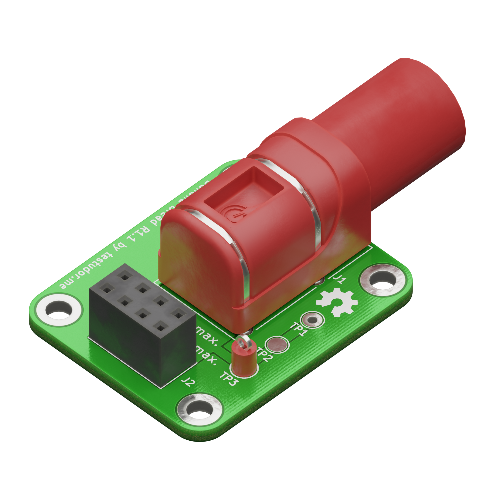

# Banana Bread

This is part of the "Modular Breadboard" parent project.

This module makes it easy to add 4mm banana jack connections to your breaboard project! It has a high quality gold-plated banana socket and supports both standard and "safety" type connectors. An assortment of test points makes it easy to attach test hooks or probe stuff using standard multimeter leads.

The input is rated for 24A continuous current and PCB traces are spec'd to match that.

The PCB mount banana jack I used is the Schützinger SWEB 8094. It's easily available in Europe but might be hard to acquire elsewhere. Luckily there's a bunch of other compatible parts with the exact same footprints and measurements that might be easier to come by. Here's a list:

* CLIFF FCR7350
* Stäubli XELW-4
* Pomona 73099
* Amass 24.245.*

Feel free to open an issue if you found other compatible parts so I can add them to the list.