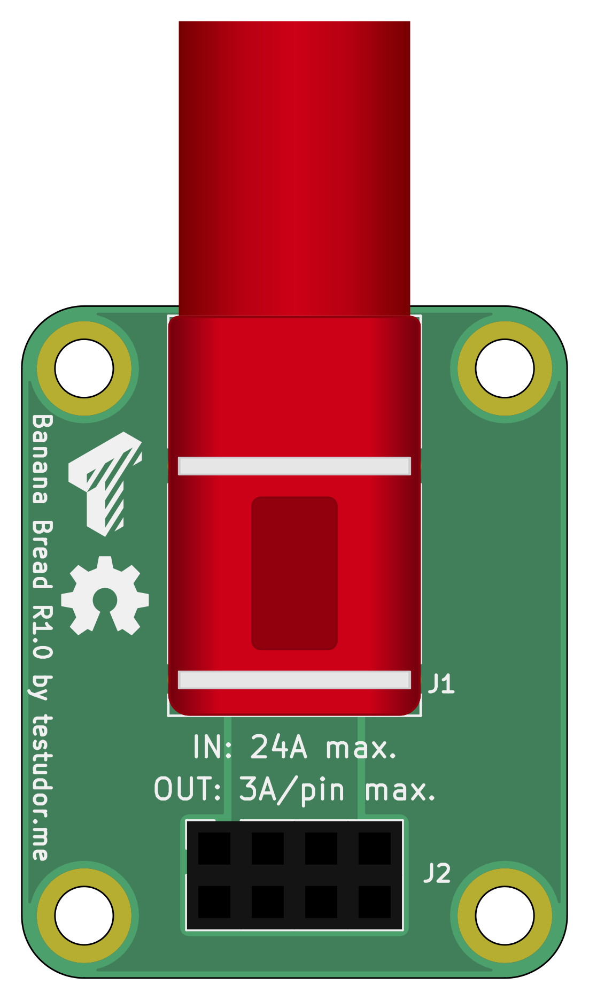
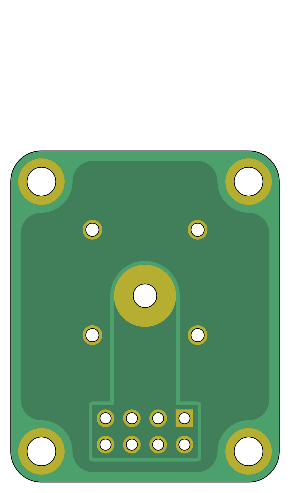

# Banana Bread

This is part of the "Modular Breadboard" parent project.

This module makes it easy to add 4mm banana jack connections to your breaboard project! It has a high quality gold-plated banana socket and supports both standard and "safety" type connectors. 

The input is rated for 24A continuous current and pcb traces are spec'd to match that.

|  |  |
|:---:|:---:|